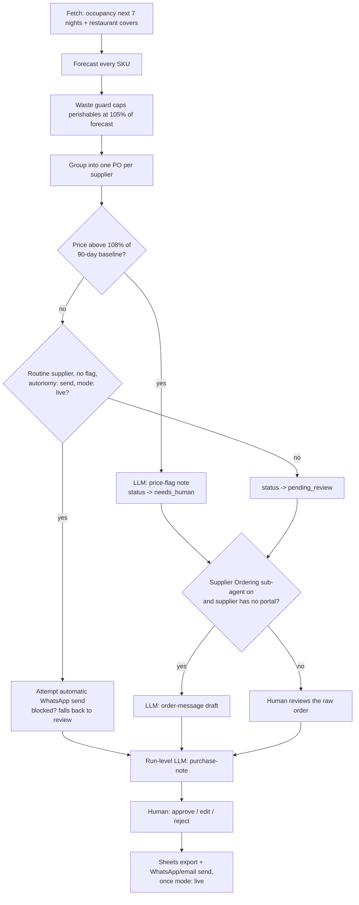

# Procurement / Supply AI - "The Quartermaster"

Argues every order from the forecast, not habit.

## What it does

**Argues every order from the forecast, not habit. It reads the coming
nights of occupancy and the covers already on the restaurant book — the
same forecast the pricing engine prices against — applies
per-occupied-room consumption rates and supplier lead times to every stock
line, and generates the orders with the reasoning on each line. It watches
days of cover against par, caps perishables at forecast so waste can't
creep back in, flags supplier price creep against the 90-day average, and
sends routine orders to suppliers automatically (e.g. the daily bakery
order over WhatsApp).**

## What it won't do

**Won't order on zero-guest nights, and won't exceed the perishables guard
even when a par level says otherwise; price creep gets flagged rather than
silently paid.**

## Why it matters

**Eliminates over/under-ordering and the daily "did anyone call the
baker?" Cost discipline on autopilot.**

## What to expect

**Every order sized to real occupancy with the reason on the line; waste
write-offs bend down the week it switches on.**

ROI (from the roster): −12% F&B over-ordering & waste (labor).

## Who it's for

Any hotel with a kitchen or a restaurant that orders stock on a repeating
schedule - the same forecast this agent uses (occupancy + restaurant
covers) is what a small independent boutique property and a 200-room
resort both already track, just not usually turned into an order sheet
automatically. It replaces the job of a purchasing manager (or a duty
manager doing it on the side) manually eyeballing the walk-in and guessing
at next week's numbers, and it is most useful the moment you have more
than a handful of suppliers or SKUs to keep straight.

It assumes: a PMS or a CSV export of your bookings, a restaurant covers
book you can export as a plain file, and a list of your suppliers with
lead times and (ideally) 90 days of price history. None of that needs to
be perfect on day one - `make demo` works with zero credentials and
invented sample data so you can see exactly how it reasons before
connecting anything real.

## How it works



The decisioning is entirely deterministic - `tools/supply_engine.py` is
pure functions, no model call inside it. The three LLM tasks only ever
turn a decision already made into a sentence a person can read: a run-level
morning note, a price-flag explanation, and (Supplier Ordering sub-agent
only) a ready-to-send supplier message. See `docs/how-it-works.md` for the
full design, including why that split matters.

### The two modes

| Mode | What happens |
|---|---|
| `shadow` (default) | Reads, forecasts, drafts, queues. Never sends a message, never logs an order as sent - not even one you have approved. |
| `live` | Approved orders are really sent. Everything else still waits. |

### The review loop

An order becomes `pending_review` (or `needs_human` if a price is
flagged), a person approves, edits the drafted supplier message, or
rejects it, and only an approved/edited order can ever be sent -
`workflows/80-review.md`.

### What runs when

| Workflow | Cadence | Calls a model? |
|---|---|---|
| `workflows/10-procurement.md` (main loop) | `morning`, 07:00 daily (`config/agent.yaml: schedule.procurement`) | 0-1 `price-flag` per flagged order, 1 `purchase-note` per run |
| `workflows/20-supplier-ordering.md` (sub-agent, off by default) | Same pass as the main loop | +0-1 `order-message` per no-portal order |
| `workflows/80-review.md` | Whenever a person checks the queue | No |

**Folded in:** Supplier Ordering AI ("The Buyer") - off by default, in the
same loop. Full detail further down, under "Sub-agents in this repo", and
in `docs/sub-agents.md`.

## What you need

- **Occupancy**: a PMS with a read API this repo already speaks
  (`cloudbeds`), or a CSV export (`csv` - works with any PMS), or just the
  bundled sample data to start (`mock`).
- **Restaurant covers**: a plain file export from your POS or booking
  system - no adapter needed, see `docs/integrations.md`.
- **A supplier list**: name, what they supply, lead time, whether they
  take orders online, and (ideally) 90 days of price history per item.
- **WhatsApp, optional**: only needed for the routine auto-send lane or the
  Supplier Ordering sub-agent's drafted messages - your own UniPile
  account, or a webhook into your automation tool.
- **Email, optional**: only needed if a supplier's drafted message picks
  `channel: email` - a real `imap` or `gmail` adapter and that supplier's
  address, or `send` refuses the email and keeps the approval instead of
  sending it some other way.
- **A Claude Code subscription or an Anthropic API key** - either works;
  `docs/safety.md` has the honest trade-off.
- **Time**: about 20 minutes to connect real occupancy and build your own
  catalogue file; the demo runs in under a minute with zero setup.

## Quick start (5 minutes, no credentials)

```bash
git clone https://github.com/th1-ai/procurement-supply-ai.git procurement-supply-ai
cd procurement-supply-ai
make setup
make demo
```

You should see something like this (shortened):

```
Procurement / Supply AI demo - forecasting from 2026-09-01 on fixtures/hotel/

[info ] thinking text=90 occupied room-night(s) on the books across the next 7 nights (31% of capacity, 12.9 rooms a night), plus 700 restaurant cover(s) already booked through 2026-09-07.
[info ] thinking text=Waste guard trimmed 4 perishable line(s), saving about EUR 16.51 this week: ...
[info ] thinking text=Price watch: 1 line(s) checked against their 90-day baseline - flagged: Sea bass, whole from Frigo Atlântico is EUR 20.72/kg, 12% above its 90-day baseline of EUR 18.50/kg.
[info ] thinking text=EUR 396.05 across 4 order(s) for 90 room-nights and 700 covers - EUR 934.19 less than a flat par top-up would have bought.
[info ] queued item_id=... supplier=Frigo Atlântico status=needs_human total_eur=257.04
[info ] queued item_id=... supplier=Lisbon Bakery Co. status=pending_review total_eur=23.15
[info ] queued item_id=... supplier=Linens & Co status=pending_review total_eur=52.0
[info ] queued item_id=... supplier=Office & Guest Supplies status=pending_review total_eur=63.86

This run orders from three suppliers for just over the week's forecast, sized to the room-nights and covers already on the books rather than a flat top-up. The seafood order from Frigo Atlantico is flagged: sea bass is running above its usual price, so that line is worth a look before you approve it. ...

Current orders:
  Office & Guest Supplies  EUR    63.86  status=pending_review
  Linens & Co              EUR    52.00  status=pending_review
  Lisbon Bakery Co.        EUR    23.15  status=pending_review
  Frigo Atlântico          EUR   257.04  status=needs_human  [PRICE FLAG]

Waste down 53.8% since the AI took the order book - EUR 48.40 a day before, EUR 22.38 a day since. That is EUR 9497.30 a year that used to go in the bin.

1 of 4 order(s) need a person to look first (a flagged price always does - see docs/safety.md).
Nothing was sent: mode is shadow, and demo never calls send() at all.
Next: `make review` to see the drafts, or read workflows/10-procurement.md.

DEMO OK — 4 items processed, 4 drafted, 0 sent (shadow)
```

Every supplier and item there is invented - a fictional "Hotel Aurora" -
so you can see exactly how the Quartermaster reasons before it ever sees
your real catalogue. Next: open `claude` in this folder and follow "Set up
with Claude Code" below.

## Set up with Claude Code

Open `claude` in this folder. Paste each prompt below in order - Claude
will follow the named workflow file, which tells it exactly which tools to
run and what to check.

**Phase 1 - first run.**

> Read `workflows/00-setup.md` and walk me through it. I have not run this
> agent before.

**Phase 2 - the weekly ordering loop.**

> Read `workflows/10-procurement.md`. Run one pass and show me what the
> Quartermaster ordered, and why, in plain language.

**Phase 3 - the review queue.**

> Read `workflows/80-review.md`. Show me what is waiting for me, one at a
> time, and act on my decisions.

**Phase 4 - the Supplier Ordering sub-agent (optional).**

> Read `workflows/20-supplier-ordering.md` and help me decide whether to
> turn it on for our suppliers.

**Phase 5 - going live.**

> Read `workflows/90-go-live.md`. Go through the checklist with me
> honestly - do not recommend going live until it is genuinely true.

You can also just run the agent directly - `/procurement-supply-ai` in
this folder runs the main loop and works the queue in one command; see
`.claude/skills/procurement-supply-ai/SKILL.md`.

## Connect your systems

Full detail, including the "implement your own" recipe, is in
`docs/integrations.md`. This section covers only what this agent itself
uses. It never reads email, and only sends through email once you
configure a real adapter - see the Email row below.

### PMS - `systems.pms.adapter` in `config/hotel.yaml`

| Adapter | Status | Needs |
|---|---|---|
| `mock` | universal | nothing - reads `fixtures/hotel/reservations.json` |
| `csv` | universal | a CSV export in `data/imports/reservations.csv` |
| `cloudbeds` | built | OAuth app + refresh token (read-only) |

### Restaurant covers - no adapter

`fixtures/hotel/covers.json` (or your own file at the same path) - a plain
list of `{day_offset, covers}` rows. No system in this family models a
restaurant booking book generically; see `docs/integrations.md`.

### Email - `systems.email.adapter` in `config/hotel.yaml`

| Adapter | Status | Needs |
|---|---|---|
| `mock` | universal | nothing - but this agent treats it as "not set up" and refuses to send |
| `imap` | universal | an IMAP/SMTP mailbox (send-only for this agent) |
| `gmail` | built | a Gmail OAuth app (send-only for this agent) |

### Messaging - `systems.messaging.adapter`

| Adapter | Status | Needs |
|---|---|---|
| `mock` | universal | nothing |
| `unipile` | built | your own UniPile account |
| `webhook` | universal | any URL |

### Sheets - `systems.sheets.adapter`

| Adapter | Status | Needs |
|---|---|---|
| `csv` | universal | nothing - writes `data/exports/procurement_orders.csv` |
| `google` | built | service account JSON |

### Everything else

`procurement` (actual portal placement), `pos`, `accounting`, `reviews`,
`calendar`, `payments` and `locks` are **stubs** - the interface exists,
nothing is implemented. `docs/integrations.md` explains why `procurement`
specifically stays a stub (no generic supplier-portal API exists) and has
the recipe for wiring in one specific supplier's system.

## Run it

```bash
make run                              # one pass over the next 7 nights
make run ARGS="--limit 5"             # just the first five supplier orders
make run ARGS="--dry-run"             # compute and print, write nothing
make run ARGS="--as-of 2026-09-01"    # forecast from a fixed date
make watch                            # loop on the configured interval
make schedule                         # cron / launchd / systemd snippet for this machine
```

If `llm.provider` is `interactive` (the default), a run can stop with exit
code 3 and park one or two prompts in `data/pending/` - answer each and
re-run; see `workflows/10-procurement.md`.

**Scheduling for real.** `config/agent.yaml`'s `schedule.procurement` job
(`tools/run.py --once`, cadence `morning`) is what `make schedule` reads.
On a Mac, `make schedule ARGS="--target launchd"` prints a `launchd` plist;
on a Linux box or a VPS, `make schedule ARGS="--target systemd"` or the
default cron snippet. `scheduler/crontab.example` shows the exact output
for the shipped `procurement` job.

**Subscription or API.** `llm.provider: interactive` or `claude-code` uses
the Claude Code subscription already open in this session or on this
machine, at no extra cost - this agent makes only a handful of calls a
week, so there is little reason to move it to the metered API unless you
run many properties from one deployment. `docs/safety.md` has the full,
honest comparison.

## Go live

`mode: shadow` (the default) never sends or logs anything as sent - not
even an order you have approved. Going live is entirely the decision of
the person running this agent; `workflows/90-go-live.md` has the full
checklist, including running `python3 tools/review.py stale` first to clear
whatever built up during shadow testing. In short:

```yaml
# config/hotel.yaml
mode: live
```

`review.require_approval_for` still lists `send_message` and `pms_write`
by default afterwards - going live means **approved orders get sent**, not
that anything skips review. The one deliberately-automatic exception (a
routine order to a named supplier) needs two more opt-ins on top of
`mode: live` - see `docs/how-it-works.md` design decision 6 and
`workflows/90-go-live.md`.

## Guardrails & safety

Full detail in `docs/safety.md`. The short version:

- **Shadow blocks everything, no exceptions** - not even an order a human
  approved. `core/review.py`'s `evaluate_write` is the single function
  every write goes through.
- **Won't order on a zero-guest night** - falls out of the forecast
  formula, not a special case.
- **Perishables never exceed 105% of forecast**, even if the par level
  would order more - a hard cap, not a suggestion.
- **A price more than 8% above its 90-day baseline is always flagged**,
  never silently approved or averaged in.
- **No edit-quantity control, anywhere.** Every quantity already carries
  its own arithmetic; the fix for a wrong number is a config knob or a
  catalogue fact, not a hand-edit.
- **No guest data touches this agent at all** - only supplier names, item
  names and prices ever reach a model.
- **EU AI Act (Article 50).** This agent's only person-facing text is the
  supplier order message; `docs/safety.md` has suggested wording for a
  disclosure line if your supplier relationship needs one.

## Sub-agents in this repo

### Supplier Ordering AI - "The Buyer"

**Does.** Where a local supplier has an online ordering portal, it places
the F&B order directly, matching quantities to occupancy and par levels,
and schedules the delivery. No phone calls, no manual basket.

**Won't.** Needs a supplier with an online ordering system; where there
isn't one, it falls back to a drafted order for a human to place.

**Why.** Closes the loop the Procurement AI starts, going from what to
order to actually placing and scheduling it.

**Output.** Hands-free F&B replenishment matched to real occupancy.

Off by default - the parent works fully without it. Turning it on adds a
portal label plus an audit line for suppliers with an online ordering
system, and an LLM-drafted, ready-to-send message for suppliers without
one. It never bypasses human approval on its own; only the parent's
separate routine-order lane can do that, and only once you have opted in
three times over. See `workflows/20-supplier-ordering.md` and
`docs/sub-agents.md` for the full picture, including exactly what "places
the F&B order directly" means here (there is no generic supplier-portal
API to build against - `docs/integrations.md` explains why and gives the
recipe for one specific supplier's system).

## Customising

**`knowledge/`** - `knowledge/suppliers.md` (contacts, lead times, portal
status) and `knowledge/ordering-policy.md` (what the numbers mean for this
property). Copy `knowledge/suppliers.example.md` and
`knowledge/ordering-policy.example.md` and fill them in - see
`knowledge/README.md`.

**`prompts/`** - `prompts/purchase-note.md`, `prompts/price-flag.md`,
`prompts/order-message.md` are plain markdown with a `{{hotel_name}}`
placeholder; edit them directly, no code change needed. Each has a
matching JSON schema in
`prompts/schemas/` that the model's answer is validated against.

**`config/agent.yaml`** - every number the engine uses:
`procurement.horizon_days`, `covers_per_occupied_room`,
`par_buffer_pct`, `waste_cap_pct`, `price_watch_threshold_pct`, the five
rule toggles (`occupancy_forecast`, `waste_guard`, `par_buffer`,
`supplier_consolidate`, `price_watch`), and `procurement.routine_orders`
for the one auto-send lane. Change one, then `make run ARGS="--dry-run"`
to see the effect before it writes anything.

**The catalogue** - `supply_items` in `data/agent.db`, seeded once from
`fixtures/hotel/supply_items.json`. Replace that file with your own SKU
list and delete `data/agent.db` to reseed from scratch (this also clears
every order and the review queue - only do it once, at setup).

**Adding a language.** The three LLM tasks are all internal-facing prose
(a purchasing note, a price flag, a supplier message) - there is no guest
language to detect or switch on. If your supplier messages should be in a
language other than English, edit `prompts/order-message.md` directly; it
is plain markdown.

## Troubleshooting & FAQ

Full detail in `workflows/99-troubleshooting.md`. Common ones:

**"`make demo` doesn't show `DEMO OK`."** Make sure `make setup` ran first.
`tools/demo.py` forces every adapter to mock and reads a fixed date - if
you deleted or renamed a fixture, restore it from git.

**"`make doctor` fails on `hotel identity`."** Expected on a fresh clone -
the property name is still the shipped placeholder. Edit
`config/hotel.yaml`.

**"A quantity looks wrong."** There is no way to edit it directly - read
the line's `reason` first, it shows the exact arithmetic. The usual cause
is a stale `on_hand` or a wrong `par_level`/`daily_use_per_occ_room` in the
catalogue. Fix that and re-run.

**"Why doesn't `send` do anything?"** `mode` is probably still `shadow` -
that is correct, it prints an explanation and sends nothing, even for an
order you just approved. `workflows/90-go-live.md`.

**"The bakery order didn't send itself."** The routine auto-send lane
needs three separate opt-ins (`autonomy: send`, `mode: live`, and
`send_message` removed from `review.require_approval_for`) - see
`docs/how-it-works.md` design decision 6. Until all three are true it
safely falls back to the normal review queue.

## Measuring the benefit

```bash
make report
```

Five numbers tied to the roster claims above: orders by supplier and
status, this week's total against a flat par-level top-up, how many orders
needed a price-creep check, the edit rate on drafted supplier messages,
and the waste trend (before/after the day this agent took over the order
book). See `docs/benefits.md` for what each one means and the honest
caveats - in particular, this report is only as good as the catalogue's
par levels, on-hand accuracy and price baselines.

## About

Built by [TH1](https://th1.ai) - AI agents for independent hotels.

**Licence.** MIT - see `LICENSE`.

**Want it run for you, or built out further?** TH1 sets this up, connects
your real systems, and keeps it tuned. [th1.ai](https://th1.ai)

**Changelog.**

- Initial release: forecast-driven ordering, price watch, waste guard,
  Supplier Ordering sub-agent, routine auto-send lane.
