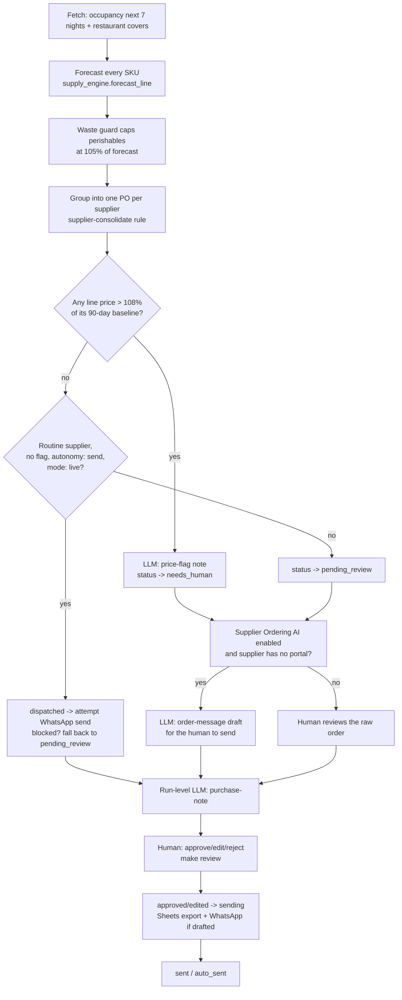

# How Procurement / Supply AI works

"The Quartermaster" argues every order from the forecast, not from habit. It
never guesses at a number: every quantity on every order line is arithmetic,
written into the line's own reason string, over occupancy and covers you
already have on the books. The only place a model is used is to turn a
finished decision into a sentence a person can read — never to decide a
quantity or a price.

## Deterministic decisioning, LLM for language

- `tools/supply_engine.py` is pure functions over plain data: no I/O, no
  model call, no randomness. Give it the same catalog, occupancy and covers
  twice and it returns the same orders twice. Every test in
  `tests/test_procurement_engine.py` calls it directly.
- Three LLM tasks exist, and none of them touches a quantity, a price or a
  gate — they only write prose about a decision the engine already made:
  - `purchase-note` — one short morning narrative per run (`prompts/purchase-note.md`).
  - `price-flag` — one note per order that tripped the 90-day price-creep
    check, explaining what crept and by how much (`prompts/price-flag.md`).
  - `order-message` — for the Supplier Ordering sub-agent: a ready-to-send
    message for a supplier with no online ordering portal
    (`prompts/order-message.md`).
- A message that leaves the building **without** a human reading it first
  (the routine daily order, see below) is built from a fixed template in
  `tools/supply_engine.py::routine_order_message`, never from the model.
  Nothing unreviewed is ever LLM-authored — see "Design decisions" below.
- **`purchase-note` on `llm.provider: mock`** (`make demo`, `make test`)
  never calls a model at all: `tools/run.py::purchase_note` computes the
  note straight from the run's own `ProposalResult` via
  `tools/supply_engine.py::narrate_run` — the same pure-function pattern as
  `summarise_waste`. This is deliberate: a canned fixture would go stale the
  moment a hotel replaces the sample catalogue (real supplier names, real
  counts, real flagged lines change; the fixture text would not). Every
  other provider (`interactive`, `claude-code`, `anthropic`) still asks a
  real model to write the note from the same facts.

## The loop (`tools/run.py --once`)



## What runs when

| Workflow | Cadence | Provider calls |
|---|---|---|
| `10-procurement.md` (main loop) | Daily, or before the weekly order day | 0-1 `price-flag` per flagged order, 0-1 `order-message` per no-portal order (Buyer only), 1 `purchase-note` per run |
| `20-supplier-ordering.md` (sub-agent) | Same pass as the main loop, when enabled | folded into the same run |
| `80-review.md` | As often as a human wants to check the queue | none |
| `85-*` | not applicable — this agent has no coach layer | — |

## Modes and the review loop

`mode: shadow` (default) never writes anywhere at all — not the order-audit
export, not a message, not even for an order a human has approved.
Approve/edit/reject in shadow only record the decision and teach the agent;
`tools/review.py send` prints a short explanation and does nothing while
shadow is on (`core/review.py`'s `evaluate_write`: shadow is a global
kill-switch with no exception). Going live runs
`python3 tools/review.py stale` first, to clear the shadow-era queue rather
than send something stale. `mode: live` still gates `send_message` and
`pms_write` by default; the one intentionally-automatic path (the routine
daily order to a designated supplier, e.g. the bakery) is described in
"Design decisions" below.

## Data model

- `items` (core) — one row per supplier order, `kind="supply_order"`,
  `source="procurement"`, `external_id = "<week_start>:<supplier-slug>"` so
  re-running the same week is a no-op. `payload` carries the full order
  (lines, reasons, totals, demand summary, which stages this item still
  needs). `draft` carries the human-facing order (a plain summary, or the
  LLM-drafted supplier message when the Supplier Ordering sub-agent wrote
  one).
- `supply_items` (own table, `tools/store_ext.py`) — the SKU catalog and its
  live `on_hand`, seeded once from `fixtures/hotel/supply_items.json`.
  "Fast-forward: delivery arrives" (`tools/review.py deliver <id>`)
  increments `on_hand` per line and is the only writer of it after seeding.
- `waste_log` (own table) — daily waste figures for `tools/report.py`'s
  trend line, seeded from `fixtures/hotel/waste_log.json`.

## Idempotency

- **Row-level**: `external_id = "<week_start>:<supplier>"` — regenerating
  the same week returns the same item; the payload is only rewritten when it
  actually differs (`store.upsert_item`).
- **Stage-level (the interactive-provider trap)**: an order can need up to
  two independent LLM calls — `price-flag` (only if a line tripped the
  threshold) and `order-message` (only if the Supplier Ordering sub-agent is
  on and the supplier has no portal). With `llm.provider: interactive` the
  first call can succeed on one run and the second can pend on the very next
  line of the same pass. `tools/run.py::process_order` checks **each stage's
  own output field**, not just "does this item exist" or "is one field set":

  ```python
  needs_flag = order.has_price_flag
  needs_message = buyer_enabled and not order.has_portal and not order.is_routine
  done = (not needs_flag or payload.get("price_flag_note")) and \
         (not needs_message or item.draft is not None)
  if done:
      return item, False
  ```

  A retry after answering only the `price-flag` prompt resumes straight into
  `order-message` — it does not re-ask a question already answered, and it
  does not skip the item and leave it stuck at `new` forever. See
  `tests/test_procurement_retry.py::test_interactive_resumes_at_pending_stage`.
- **Run-level**: the `purchase-note` narrative is one per week, not one per
  pass. `tools/store_ext.py`'s `purchase_notes` table (keyed on
  `week_start`) tracks whether a week already has a note; `tools/run.py`'s
  `one_pass` only calls `purchase_note()` again when that week has no note
  yet, or this pass actually processed something new. A re-run of an
  already-noted week with nothing new re-prints the cached note (or nothing,
  if there was none) — it never parks a fresh interactive prompt. See
  `tests/test_procurement_purchase_note_dedup.py`.
- **Delivery**: `tools/review.py deliver <id>` is blocked by the FSM from
  running twice — it requires `review_status == "sent"` and moves the order
  to a `payload["delivered_at"]` marker; a second call is a no-op (checked
  before incrementing `on_hand`).
- **Sequence counters**: not used — this agent has no invoice numbering.

## Design decisions (spec was silent or ambiguous)

1. **Restaurant covers have no adapter.** Nothing in `core/adapters` models
   a restaurant booking book. `tools/supply_engine.py::load_covers` reads
   `fixtures/hotel/covers.json` (or `data/imports/covers.json` in
   production) directly, next to the PMS fixtures — the same pattern
   Front Desk AI uses for `fixtures/hotel/experiences.json`. A real hotel
   exports its POS/reservation covers book to that file; no two-way sync is
   needed since this agent never writes covers.
2. **The 24-SKU catalogue is invented** (spec section 11, open question 5).
   This repo ships 18 SKUs across linen, F&B and other, including the two
   named anchors (sea bass, bath towels) and a designated "routine" bakery
   supplier for the automatic-order example.
3. **Price-watch is seeded to actually trigger once** (open question 2).
   One line (a Frigo Atlântico seafood item) carries a unit cost 12% above
   its 90-day baseline in `fixtures/hotel/supply_items.json`, so the
   flagged branch — and the two-stage LLM retry it exercises — is real, not
   dormant, out of the box.
4. **`COVERS_PER_OCC_ROOM` is a config knob** (open question 3):
   `config/agent.yaml: procurement.covers_per_occupied_room` (default 4.6,
   the demo's constant) — a real hotel recalibrates it from its own numbers.
5. **No generic "supplier portal" API exists to build against** (open
   question 1 and the Supplier Ordering spec's open question 1). Rather than
   fake an integration, `Procurement` stays a `stub` (see
   `docs/integrations.md`) and every "sent" order — portal or not — is
   recorded honestly to `data/exports/procurement_orders.csv` via the
   universal Sheets adapter, labelled with a `channel` column
   (`portal` / `whatsapp` / `manual`). A hotel with one specific supplier
   API wires it in as the stub's recipe describes.
6. **"Sends routine orders automatically" is real, but opt-in twice over.**
   `send_message` is gated by default (`review.require_approval_for`), so
   the one truly-automatic path — a routine order to a designated supplier,
   e.g. the daily bakery order — only fires once a hotel has (a) set
   `procurement.routine_orders.autonomy: send` in `config/agent.yaml`, (b)
   set `mode: live`, and (c) removed `send_message` from
   `review.require_approval_for` in `config/hotel.yaml` (a `workflows/90-go-live.md`
   step, done deliberately after the review queue has been exercised). Until
   then the attempt is caught (`core.review.WriteBlocked`) and the order
   falls back to `pending_review` like any other — the same pattern
   `revenue-management-ai` uses for its own auto-publish path. The routine
   message text itself is a fixed template, never LLM-authored, because
   nothing reviews it before it sends.
7. **Supplier Ordering AI (the Buyer) is folded into the same loop and
   tables**, not a second process — see spec section 9 and
   `docs/sub-agents.md`. It adds two things when enabled: an `order-message`
   LLM draft for suppliers with no portal, and a `channel: portal` label
   (plus the audit-log line) for suppliers that have one. It never bypasses
   human approval on its own — only the parent's routine-order lane can do
   that, and only once a hotel opts in per point 6.
8. **Hotel identity reuses "Hotel Aurora"** (Front Desk AI's invented
   property, `rooms: 42`, restaurant "Aurora Kitchen") so a hotel that reads
   more than one template in this family sees one consistent example
   property rather than a new invented name per repo.
9. **The "reply only in `hotel.languages`" rule does not apply here.** It
   governs an agent that classifies free text a guest or supplier wrote in;
   nothing in this agent ingests free text from an external party — the
   three LLM tasks all draft *outbound* prose from structured, already-
   decided data (an order's lines, a run's totals). There is no inbound
   language to detect. This was checked deliberately, not missed.
10. **`--dry-run` never seeds a row.** `tools/run.py::one_pass` reads the
    catalogue straight from `fixtures/hotel/supply_items.json` when the
    `supply_items` table is still empty, rather than seeding it, so a fresh
    clone's first command can be `make run ARGS="--dry-run"` and leave the
    database completely untouched — no item, no seeded catalogue row, no
    `runs` row, no model call. Once the table has been seeded by a real
    pass, `--dry-run` reads the real (current) `on_hand` instead, which is
    more useful and still only a read. See
    `tests/test_procurement_loop.py::test_dry_run_creates_no_rows_even_run_twice_on_a_fresh_store`.
11. **One `schedule:` job.** `config/agent.yaml`'s `schedule.procurement`
    (`tools/run.py --once`, cadence `morning`) is the only recurring job
    this agent has — there is no separate sweep, digest or coach pass.
    `tools/schedule.py --all` prints its cron/launchd/systemd snippet;
    README section 9 and `scheduler/crontab.example` show that exact
    output.
